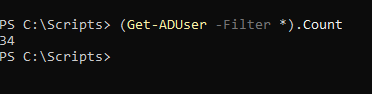
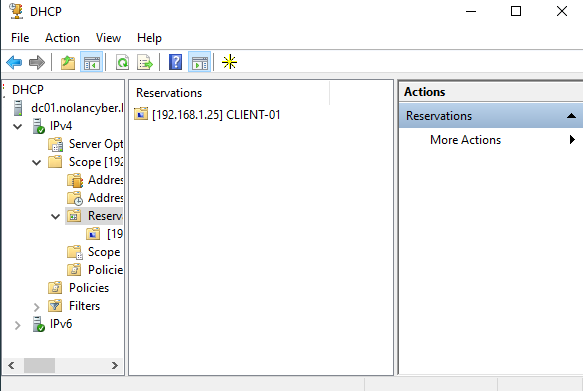
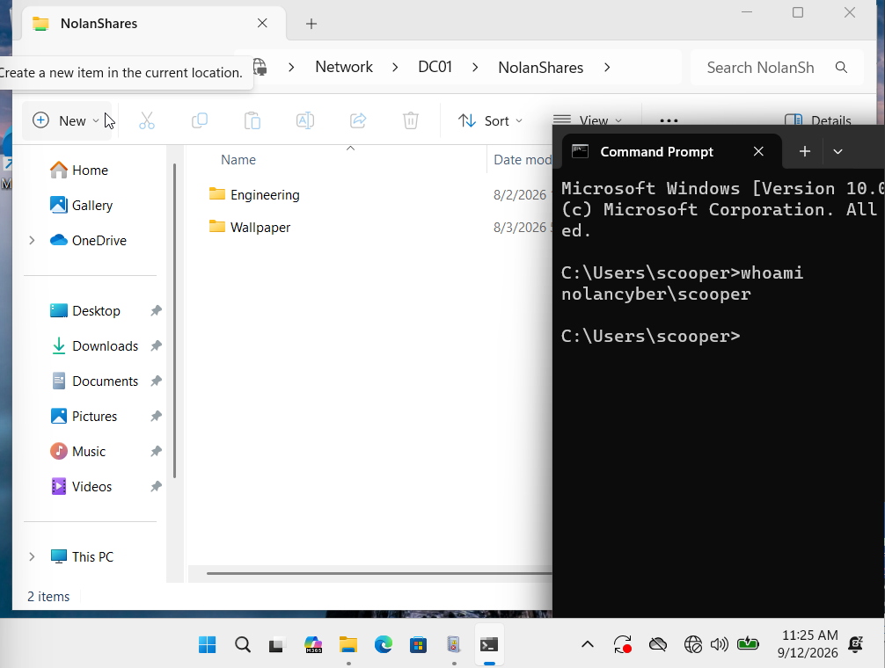

# Active Directory Home Lab

This is a Windows Server home lab I built to learn Active Directory beyond just reading about it in class. I set up a Windows Server 2022 domain controller and a Windows 11 client in VirtualBox, then built out the environment as I learned more about domain administration.

I started with users, OUs, groups, and basic permissions. From there, I added Group Policy, PowerShell user provisioning, security auditing, DHCP, network drive mapping, user restrictions, and a System State backup. I also tested the configurations from the client instead of just setting them up and assuming they worked.

## Lab Environment

- **Domain:** NOLANCYBER.local
- **Domain Controller:** DC01 — Windows Server 2022
- **Client:** CLIENT-01 — Windows 11
- **Virtualization:** Oracle VirtualBox
- **DNS Server:** DC01
- **DHCP Scope:** 192.168.1.100–192.168.1.200
- **Network:** Isolated VirtualBox internal network

## What I Configured

### Active Directory Structure

I organized the domain into separate OUs for each department and created users and security groups based on their roles. I used the groups to manage access instead of assigning permissions to individual users, which made the environment easier to manage as I added more accounts.

I also created separate OUs for workstations and administrative accounts so that policies could be applied to the appropriate users and computers.

### Group Policy and Security

I used Group Policy to manage security settings across the domain instead of configuring each computer individually. I set password and account lockout policies, added a logon banner, and created a security baseline for the Windows 11 client.

Later in the project, I also used Group Policy to automatically map the shared drive and restrict PowerShell for standard Finance users while keeping it available for IT administrators. I tested the policies from the client to make sure they were actually being applied.

### File Sharing and Permissions

I created shared folders for different departments and used both share and NTFS permissions to control who could access them. I assigned access through security groups instead of individual user accounts so permissions were easier to manage.

I tested the setup by signing in as different domain users on the Windows 11 client and checking that they could access the folders they were supposed to, while being denied access to folders they didn't have permission for.

### PowerShell Automation

I first created users manually in Active Directory, then used PowerShell to automate the process. I made one script for creating a single Finance user and another that reads employee information from a CSV and creates multiple users.

The bulk script uses each employee's department to determine which OU and security group they belong in. This was also one of the areas where I did the most troubleshooting because small issues with the CSV, PowerShell syntax, or OU paths could stop the script from working correctly.

The portfolio versions of the scripts are available in the [`scripts`](scripts/) folder. Passwords used in the lab have been replaced with placeholders.

### Security Auditing

I enabled Windows Security Auditing so I could see authentication activity in the domain. I tested both successful and failed sign-ins and used Event Viewer to find the corresponding events, including Event IDs 4624 and 4625.

This also helped me learn where authentication events are recorded and how to use the security logs to figure out what happened during a sign-in attempt.

### DHCP

I configured DHCP on the server so client devices could receive their network settings automatically instead of using a manually assigned IP address. I created and activated a DHCP scope, then tested it from the Windows 11 client to make sure it received an address from the server.

### Automatic Network Drive Mapping

I used Group Policy to automatically map the shared drive for domain users when they signed in. I tested it on the Windows 11 client and confirmed that the drive appeared automatically instead of having to connect to the shared folder manually.

### Backup and Disaster Recovery

I installed Windows Server Backup and created a System State backup on a separate virtual disk. This gave me a basic recovery option for important server components, including Active Directory, if something in the domain were to fail.

## Troubleshooting

I ran into a few problems throughout the project and had to troubleshoot them as I went. These included PowerShell and CSV errors, incorrect OU paths, DHCP/APIPA issues, Group Policy changes not showing up, and finding authentication events in the right place.

Fixing these was a useful part of the project because I had to go back through my setup and figure out what was actually causing each problem.

## Additional Testing and Validation

After finishing the main setup, I did some additional testing to make sure the environment worked with more users and under different access levels.

## PowerShell Automation

I used PowerShell to automate user onboarding instead of creating every account manually. The script reads user information from a CSV, creates each account in the correct departmental OU, and adds the user to the matching security group. I tested the script by batch-provisioning 20 additional users across the domain.

## DHCP and Network Configuration

I configured DHCP so CLIENT-01 could receive its network configuration automatically. I also added a reservation for CLIENT-01 using its MAC address so it can receive a consistent IP address through DHCP.

## User Access Testing

I tested the environment using both administrator and standard domain accounts. Using a newly provisioned Engineering account, I confirmed that the user could log into the domain and only see the shared resources available to that department. I also tested administrative elevation and confirmed that the standard account required administrator credentials for elevated access.

### Operational Availability Testing

I also tested the availability of the lab during normal operation by running repeated connectivity checks between DC01 and CLIENT-01. This gave me a way to measure whether the client remained reachable while the environment was running and being tested.

`1..1000 | ForEach-Object { Test-Connection -ComputerName CLIENT-01 -Count 1 -Quiet } | Group-Object | Select-Object Name,Count`

During a 1,000-check operational test, CLIENT-01 responded successfully to 999 of 1,000 connectivity checks, resulting in 99.9% measured availability during the test.

## Skills Practiced

- Active Directory Domain Services (AD DS)
- Windows Server 2022 administration
- Active Directory Users and Computers (ADUC)
- Organizational Units and security groups
- Group Policy Management
- DNS and DHCP
- NTFS and share permissions
- Role-based access control
- PowerShell scripting
- CSV-based user provisioning
- Windows Security Auditing
- Event Viewer
- Group Policy Preferences
- Windows Server Backup
- Windows client domain joining
- VirtualBox networking
- Troubleshooting and system validation

## Repository Contents

- [`documentation`](documentation/) — Full project documentation with configuration details and screenshots
- [`scripts`](scripts/) — PowerShell scripts used for Active Directory user provisioning
- [`data`](data/) — Sample CSV used for bulk user creation
- [`screenshots`](screenshots/) — Selected screenshots from the completed lab

## What I Learned

Before this project, I understood a lot of these concepts individually, but I hadn’t seen how they all fit together in one environment. Building the lab made Active Directory feel much less abstract and gave me a better idea of what actually goes into managing a Windows domain.

I also got more comfortable experimenting with things on my own and figuring out what to add next as the project grew.
