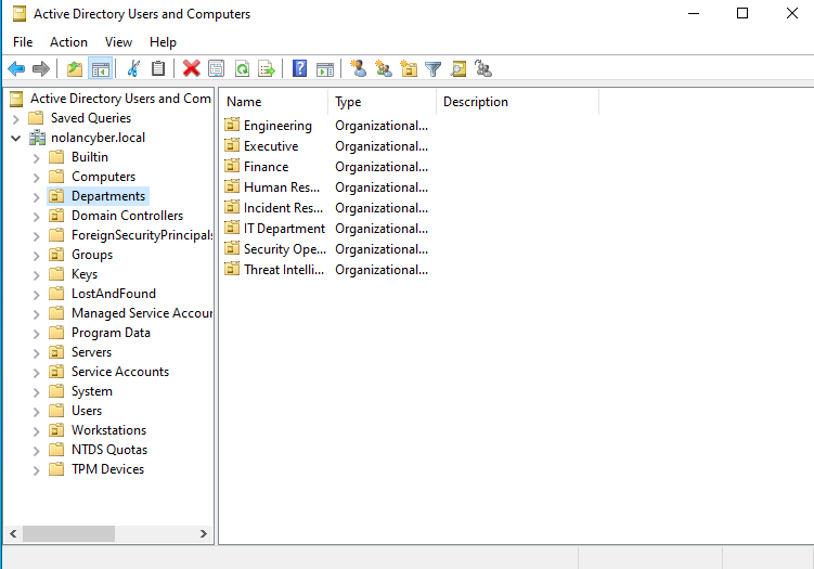
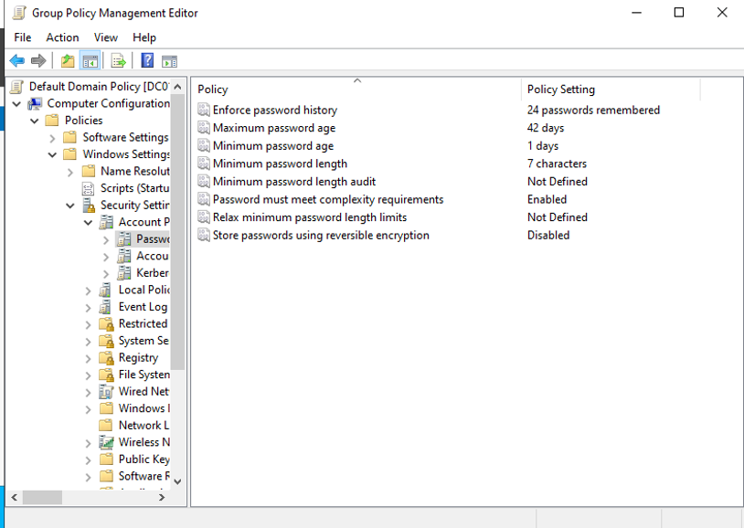
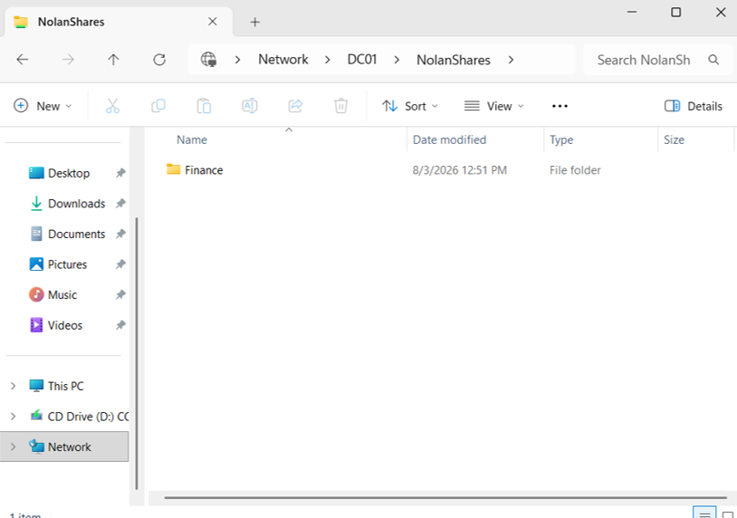
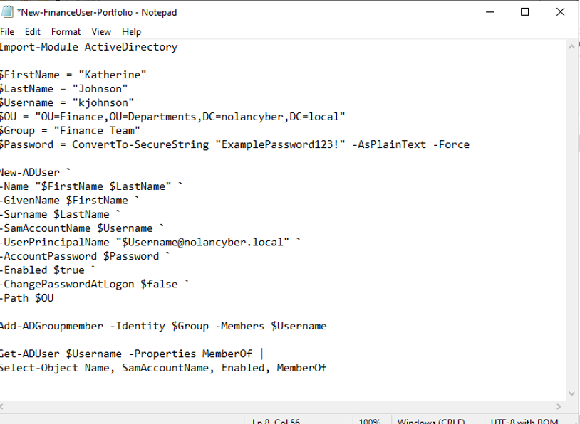
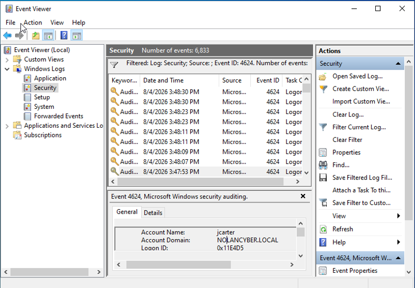
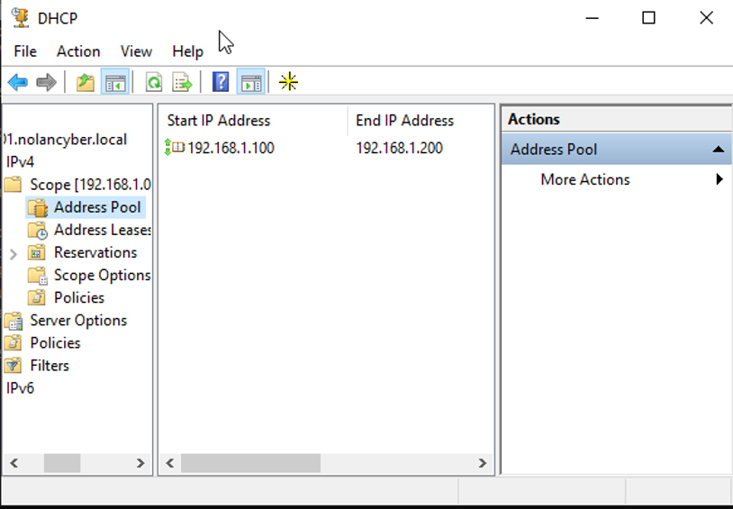
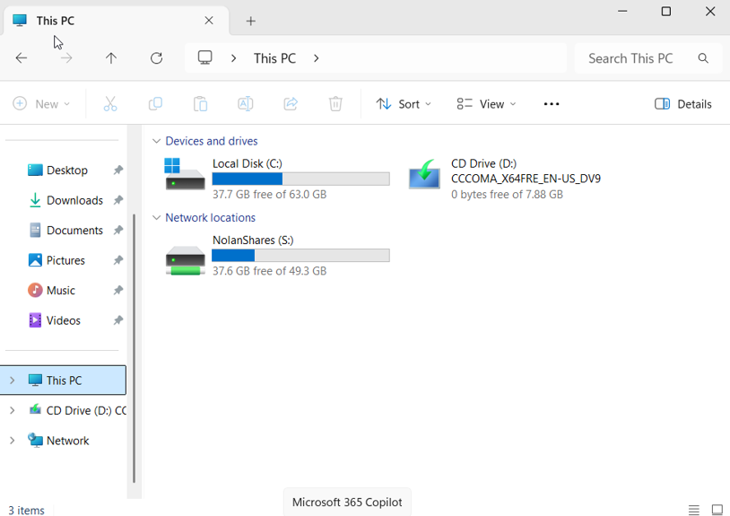
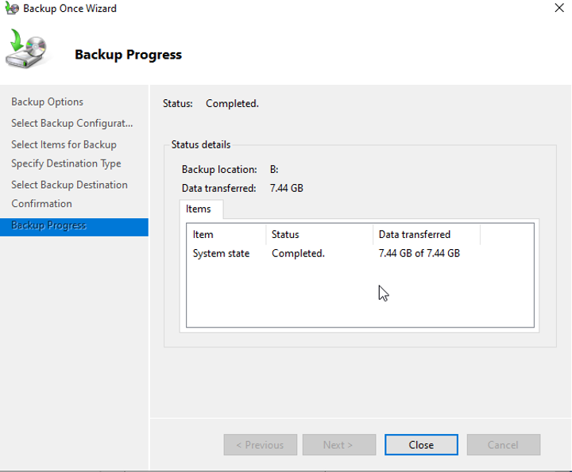

# Active Directory Home Lab

I built this project to get hands-on experience with Active Directory and understand how a Windows domain is actually managed in a business environment. I used Windows Server 2022 as the domain controller and Windows 11 as a domain-joined client, with both systems running as virtual machines in VirtualBox.

I started with the basic domain setup and then continued adding features as I learned more about how the different parts of Active Directory work together. By the end of the project, the lab included department-based users and groups, Group Policy, file permissions, PowerShell automation, security auditing, DHCP, automatic drive mapping, PowerShell restrictions, and a System State backup.

## Lab Environment

- **Domain:** NOLANCYBER.local
- **Domain Controller:** DC01 — Windows Server 2022
- **Client:** CLIENT-01 — Windows 11
- **Virtualization:** Oracle VirtualBox
- **DNS Server:** DC01
- **DHCP Scope:** 192.168.1.100–192.168.1.200
- **Network:** Isolated VirtualBox internal network

## What I Configured

### Active Directory Structure

I created Organizational Units for different departments and used security groups to manage access instead of assigning permissions to individual users. This made it easier to see how users, groups, permissions, and policies can be organized in a real domain.

### Group Policy and Security

I used Group Policy to configure password and account policies, apply a workstation security baseline, and create an interactive logon banner. Later, I also used Group Policy to automatically map a network drive and restrict PowerShell for standard departmental users while keeping it available to IT administrators.

### File Sharing and Permissions

I created department folders inside the NolanShares file share and controlled access using security groups, NTFS permissions, and share permissions.

I tested the configuration by signing in as different domain users. Users could access the resources assigned to their department while being restricted from other department folders.

### PowerShell Automation

After creating users manually, I wanted to understand how the same process could be automated. I first wrote a PowerShell script for provisioning a single Active Directory user and then expanded it to create multiple users from a CSV file.

The bulk script reads employee information from the CSV, places users in the appropriate OU, and adds them to the correct security group based on their department.

The portfolio versions of the scripts are available in the [`scripts`](scripts/) folder. Passwords used in the lab have been replaced with placeholders.

### Security Auditing

I enabled and tested Windows Security Auditing and used Event Viewer to review authentication activity. I generated both successful and failed domain logons and verified that Windows recorded Event IDs 4624 and 4625.

This helped me understand how authentication activity appears in Windows logs and how those logs can be useful for both troubleshooting and security investigations.

### DHCP

I added the DHCP Server role to DC01 and created a scope from `192.168.1.100` to `192.168.1.200`. I then changed CLIENT-01 from a static address to DHCP and verified that it received its network configuration from DC01 while continuing to use the domain controller for DNS.

### Automatic Network Drive Mapping

I used Group Policy Preferences to automatically map NolanShares as the `S:` drive for domain users. The drive gives users an easy way to reach the shared resource, while the NTFS and share permissions still control which department folders they can actually access.

### Backup and Disaster Recovery

For the final part of the lab, I added a separate virtual disk to DC01 and installed Windows Server Backup. I used the disk as a dedicated backup volume and completed a System State backup of the domain controller.

This gave me experience with the recovery side of administration instead of focusing only on configuring a working environment.

## Troubleshooting

Not everything worked correctly the first time, which ended up being one of the most useful parts of the project. Some of the problems I worked through included:

- Correcting PowerShell cmdlet syntax and parameter errors during user provisioning
- Fixing CSV formatting, OU paths, and security group assignments during bulk user creation
- Troubleshooting shared-folder permissions when users could not access the expected resources
- Determining which system to check when authentication events were not appearing where expected
- Correcting VM time synchronization so security events had accurate timestamps
- Troubleshooting CLIENT-01 when it received a `169.254.x.x` APIPA address instead of a DHCP lease
- Refreshing Group Policy when the mapped `S:` drive did not initially appear
- Testing the PowerShell restriction through different launch methods when the Start menu did not display a visible restriction message
- Configuring and verifying the additional virtual disk used for the System State backup

Working through these issues helped me understand what was happening behind the configurations instead of only knowing the steps to set them up. I became more comfortable checking network settings, Group Policy application, permissions, event logs, and PowerShell output to narrow down where a problem was coming from.

## Skills Practiced

- Active Directory Domain Services (AD DS)
- Windows Server 2022 administration
- Active Directory Users and Computers (ADUC)
- Organizational Units and security groups
- Group Policy Management
- DNS and DHCP
- NTFS and share permissions
- Role-based access control
- PowerShell scripting
- CSV-based user provisioning
- Windows Security Auditing
- Event Viewer
- Group Policy Preferences
- Windows Server Backup
- Windows client domain joining
- VirtualBox networking
- Troubleshooting and system validation

## Repository Contents

- [`documentation`](documentation/) — Full project documentation with configuration details and screenshots
- [`scripts`](scripts/) — PowerShell scripts used for Active Directory user provisioning
- [`data`](data/) — Sample CSV used for bulk user creation
- [`screenshots`](screenshots/) — Selected screenshots from the completed lab

## What I Learned

Before this project, I understood some of these concepts individually, but building the lab helped me understand how they connect. For example, a user's OU, security group membership, Group Policy, NTFS permissions, DNS configuration, and domain authentication all affect different parts of what that user can do.

I also learned that troubleshooting is a major part of system administration. Several features did not work correctly on the first attempt, and figuring out why made the concepts much easier to understand than simply following the setup steps.

The project gave me practical experience building and managing a Windows domain from the ground up and made me much more comfortable working with Active Directory, Windows Server, Group Policy, PowerShell, and basic domain administration.
